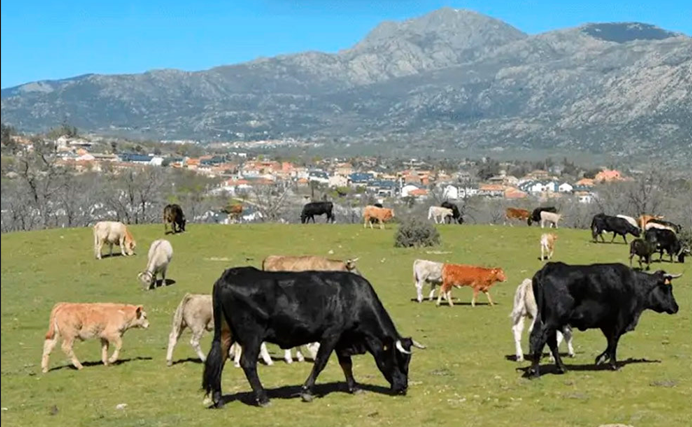

- [Cóctel](#cóctel)
  - [Ibéricos](#ibéricos)
  - [Quesos](#quesos)
  - [Canapés](#canapés)
  - [Arroces](#arroces)
- [Cena](#cena)
  - [Entreplato](#entreplato)
  - [Al Carbón](#al-carbón)
- [Alérgenos]()

En esta sección encontrarás toda la información sobre el menú de la boda.

---

# Cóctel

### Ibéricos

**Origen: Dehesa extremeña**

- Jamón 100% ibérico de bellota
- Salchichón ibérico de bellota
- Chorizo ibérico de bellota

### Quesos

- Queso manchego curado viejo de 15 meses de maduración
- Queso azul DOP Tresviso de los Picos de Europa
- Semicurado de cabra de Miraflores

### Canapés

- Mejillón tigre
- Gilda de boquerón
- Brocheta de tomate y mozzarella al pesto
- Langostino envuelto en fideos de arroz
- Mini blini de rulo de cabra, aceituna y tomate
- Bocado de foie cubierto con frambuesa Lyo
- Milhojitas de salmón ahumado y queso
- Salmorejo cordobés con virutas de jamón ibérico
- Tartaleta de rabo de toro
- Capricho de puerro y gambas
- Canapés vegetarianos

### Arroces

- Paella de verduras
- Arroz a banda
- Arroz negro

---

# Cena

### Entreplato

- Sorbete de limón

### Al Carbón

- **Pluma y Secreto Ibérico de Bellota**

  

  

      
  

    

  - **Origen**: Guijuelo, Salamanca
  - **Productor**: Carrascos Ibéricos
  - **Descripción**: El secreto ibérico proviene de los cerdos ibéricos de Carrasco, una raza autóctona criada en libertad en las dehesas de Salamanca. Estos cerdos se alimentan principalmente de bellotas y otros frutos de la dehesa, lo que confiere a su carne un sabor y una textura excepcionales.

- **Picaña**

  

  

      
  

    

  - **Origen**: Sierra de Guadarrama, Madrid
  - **Productor**: Ganadería Raúl de Lema
  - **Descripción**: La ganadería Raúl de Lema, situada en la Sierra de Guadarrama, está adscrita a la Indicación Geográfica Protegida "Carne de la Sierra de Guadarrama". Su ganado pasta en libertad, siguiendo estrictas pautas de alimentación para asegurar la máxima calidad de la carne.
  - **Corte**: La picaña es un corte jugoso y tierno, ideal para asar a la parrilla. Proviene de la parte trasera de la vaca, específicamente de la zona de la cadera.

- **Chuletón de vaca**
  
  

  

      
  

    

  - **Origen**: Mohernando, Campiña de Guadalajara  
  - **Productor**: Las Suertes del Monte
  

  - **Descripción**: Este chuletón proviene de ganado 100% Angus, incluyendo Aberdeen Angus, Black Angus y Red Angus. Criados en un entorno sin estrés y con una alimentación completamente vegetal, los ejemplares de Las Suertes del Monte producen una carne de sabor inigualable. La finca se dedica a mantener altos estándares de calidad, garantizando la excelencia en cada pieza.
  - **Corte**: El chuletón es un corte grueso y jugoso que se obtiene de la parte alta del lomo de la vaca. Es conocido por su marmoleo y su sabor intenso, ideal para asar a la parrilla o a la brasa.

- **Pollo con Verduras en Pinchos Morunos**

  - **Origen**: Pollo Campero de Origen Gallego, A Coruña
  - **Descripción**: Este pollo campero, criado en Galicia. Alimentado de forma natural y criado en condiciones óptimas, el pollo se combina con verduras frescas para crear unos pinchos morunos llenos de sabor y tradición.
- **Parrillada de verduras**

### Postre

- Vasos de postre variados
- Tarta red velvet

### Vinos

- La intrusa de Malasaña 2022 - D.O. Madrid
- Raimat Albariño 2023 - D.O. Costers del Segre

---

# Tabla de alérgenos
